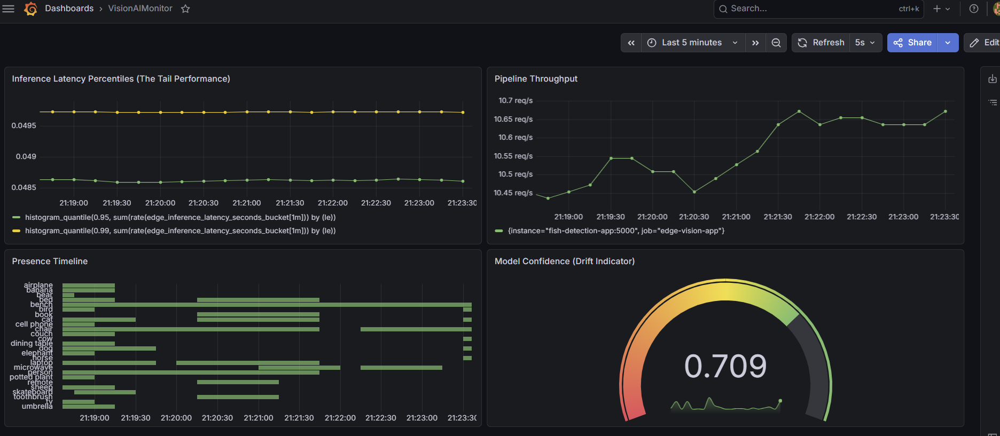

# Edge AI Vision

Real-time object detection with production-style observability. A webcam feed runs through YOLOv8 inference on a GPU, streams annotated video over HTTP, and exposes custom Prometheus metrics so model behavior — latency, detection distribution, confidence drift, camera health — is visible on a Grafana dashboard alongside GPU telemetry.

Built and tested in CI, published to GitHub Container Registry, and deployed to a home GPU server (RTX 3070, Ubuntu, Docker) via Portainer. Deployment target is an NVIDIA Jetson Orin Nano for battery-powered field use; the motivating application is wildlife and fish detection.



## Architecture

```
/dev/video0 (webcam)
      |
      v
OpenCV capture --> YOLOv8n inference --> annotated frames --> Flask MJPEG stream (:5000/video_feed)
                        |
                        v
              Prometheus metrics (:5000/metrics)

dcgm-exporter (:9400) --> GPU utilization / temp / power
```

Containers join an external `monitoring-net` Docker network and are scraped by the Prometheus instance in [homelab-infrastructure](https://github.com/mxslms/homelab-infrastructure), which feeds Grafana and Loki.

## Pipeline

Every push and pull request runs the same gate; only merges to `main` publish an image.

```
push / PR  -->  flake8 + Bandit  -->  build image  -->  start container (no camera)
                                                              |
                                                              v
                                              smoke test /healthz, /metrics, /video_feed
                                                              |
                                            (main only) -------+--> push ghcr.io/mxslms/edge-ai-vision:latest
                                                                          |
                                                                          v
                                                              Portainer pulls and deploys
```

A build that fails the smoke test is never published, so no broken image can reach the registry.

## Endpoints

| Route | Purpose |
|---|---|
| `/video_feed` | Annotated MJPEG stream |
| `/metrics` | Prometheus scrape endpoint |
| `/healthz` | Liveness check; returns 200 once the model is loaded, no camera required |

## Custom metrics

| Metric | Type | Purpose |
|---|---|---|
| `edge_inference_latency_seconds` | Histogram | Per-frame inference time; drives p95/p99 panels |
| `edge_detections_total{class_name}` | Counter | Detection volume partitioned by class |
| `edge_detection_confidence` | Gauge | Most recent detection confidence, tracked as a drift indicator |
| `edge_camera_available` | Gauge | 1 when frames come from a real camera, 0 when synthetic |
| `edge_camera_failures_total` | Counter | Times the camera dropped out mid-stream |

The last two exist because a container can be `Up` and healthy while blind. If the camera is unplugged mid-run, the stream degrades to synthetic frames rather than dying, and the drop shows up as a metric instead of as footage nobody is watching.

## Running it

Production requires the NVIDIA Container Toolkit and a V4L2 camera at `/dev/video0`. The device mapping is a hard requirement by design: if the camera is missing, the container refuses to start rather than silently serving placeholder frames.

```bash
docker network create monitoring-net
docker compose up -d
```

A test variant runs the same image without claiming the camera, so it can run alongside production on the same host:

```bash
docker compose -f docker-compose.test.yml up -d   # serves synthetic frames on :5001
```

## Roadmap

- Deploy to Jetson Orin Nano (8GB) with PIR motion triggering for battery operation (requires multi-arch image builds; CI currently produces x86 only)
- Confidence threshold on counted detections to cut false-positive noise
- Fine-tune a custom detection model for the target species
- Prometheus alert rules on `edge_camera_available` and latency drift
